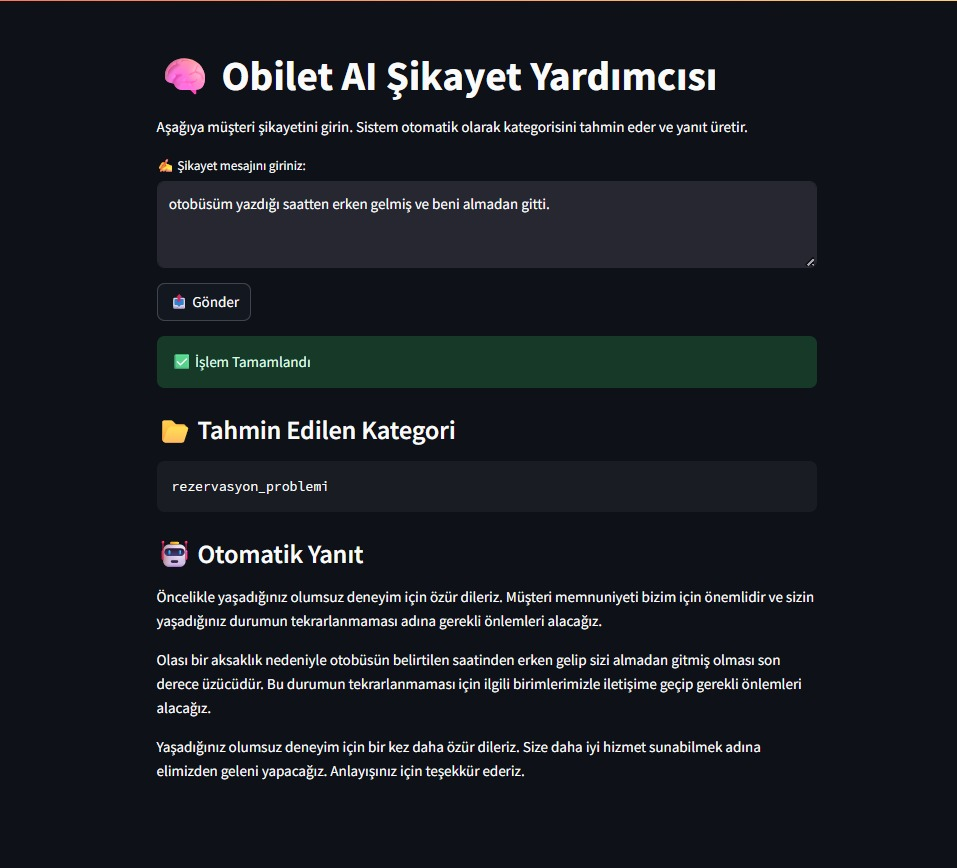

# 🧠 Obilet AI Şikayet Yardımcısı

Bu proje, OpenAI GPT-3.5 modeli kullanarak müşteri şikayetlerini:
1. Otomatik kategorize eder
2. Profesyonel, empatik bir yanıt oluşturur
3. Web arayüzü ile etkileşimli hale getirir

## 🚀 Özellikler

- 🔍 Metinden kategori tahmini (örn: `ödeme_sorunu`, `bilet_iptali`)
- 🤖 GPT destekli yanıt üretimi
- 🌐 Streamlit ile sade web arayüz
- 📂 JSON tabanlı örnek veri seti

## 🖼 Ekran Görüntüsü



## 🛠 Kurulum

```bash
git clone https://github.com/dilber13/obilet_ai_sikayet_botu.git
cd obilet_ai_sikayet_botu
pip install -r requirements.txt
streamlit run app.py
